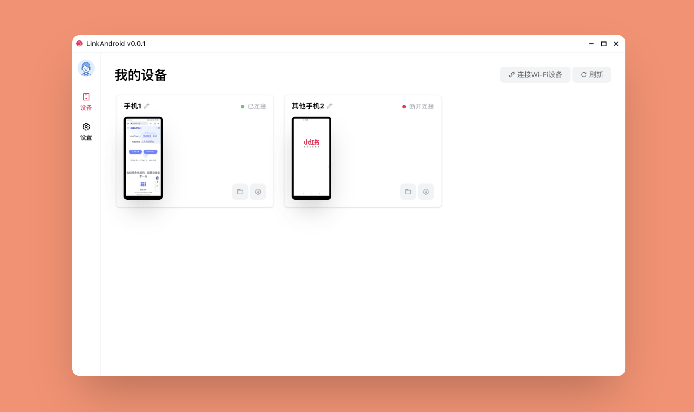

# LinkAndroid

## 软件介绍

【[中文文档](./README-CN.md)】 【[English](./README.md)】

`LinkAndroid` 是一个 `Android` 手机连接管理器，方便快捷的连接 `Android` 和电脑，可以连接多个手机，一键投屏，手机操作等。



## 技术栈

- `Electron`
- `Vue3`
- `scrcpy`
- `typescript`

## 功能特性

- 多手机控制
- 一键投屏
- 手机操作
- 国际化，支持简体中文、英语

## 二次开发

```
npm install
npm run dev
```

## License

GPL-3.0

## 本程序中使用到了以下开源项目，特此感谢

- [scrcpy](https://github.com/Genymobile/scrcpy)
- [image-beautifier](https://github.com/CH563/image-beautifier)
