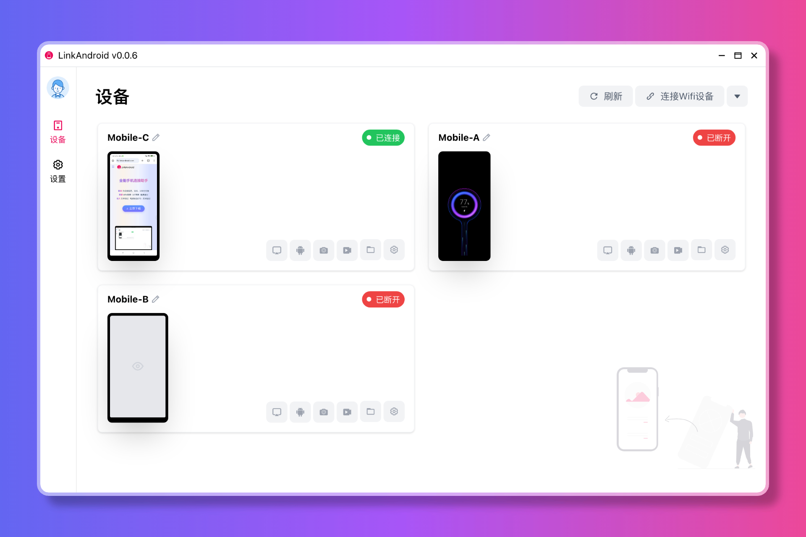

# LinkAndroid



## 软件介绍

【[中文文档](./README-CN.md)】 【[English](./README.md)】

`LinkAndroid` 是一个全能手机连接助手，方便快捷的连接 `Android` 和电脑，连接手机后可投屏、GIF/MP4录屏、截屏、文件管理、手机操作等功能。

## 功能特性

- 支持多手机连接，方便快捷控制多个手机
- 支持投屏，基于 scrcpy，支持手机操作
- 支持截屏，截屏后会自动打开截屏美化工具
- 支持GIF/MP4录屏，支持录制手机屏幕为GIF或MP4
- 支持应用管理，支持安装、卸载、启动应用
- 支持文件管理，支持文件上传、下载、删除
- 支持命令行，支持 adb、screen 命令行和手机 shell 命令行
- 支持国际化，支持简体中文、英语

## 功能预览

### 投屏


### 录屏


### 截屏功能


### 命令行


### 软件管理


## 技术栈

- `electron`
- `vue3`
- `typescript`

## 本地运行开发

> 仅在 node 20 测试过

```shell
# 安装依赖
npm install
# 调试运行
npm run dev
# 打包
npm run build
```

## 本程序中使用到了以下开源项目，特此感谢

- [image-beautifier](https://github.com/CH563/image-beautifier)
- [scrcpy](https://github.com/Genymobile/scrcpy)
- [adb](https://developer.android.com/studio/command-line/adb)
- [ffmpeg](https://ffmpeg.org/)

## License

GPL-3.0
