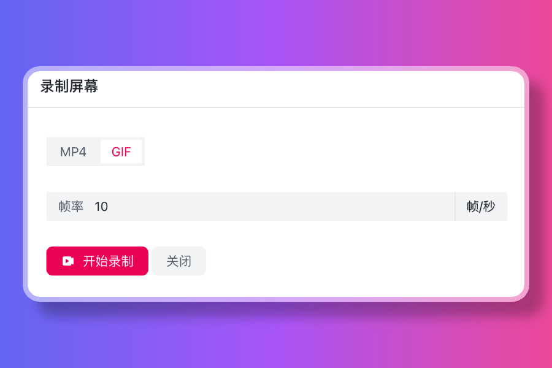
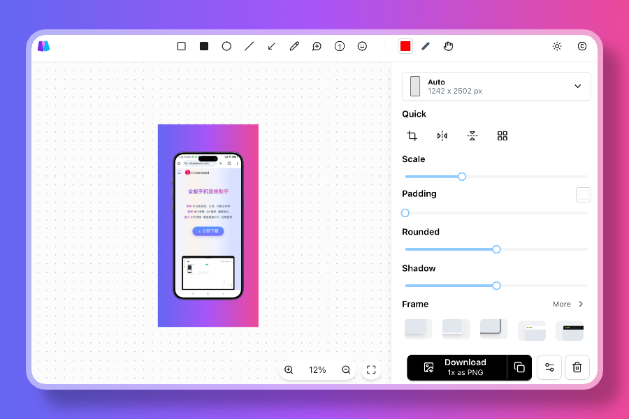
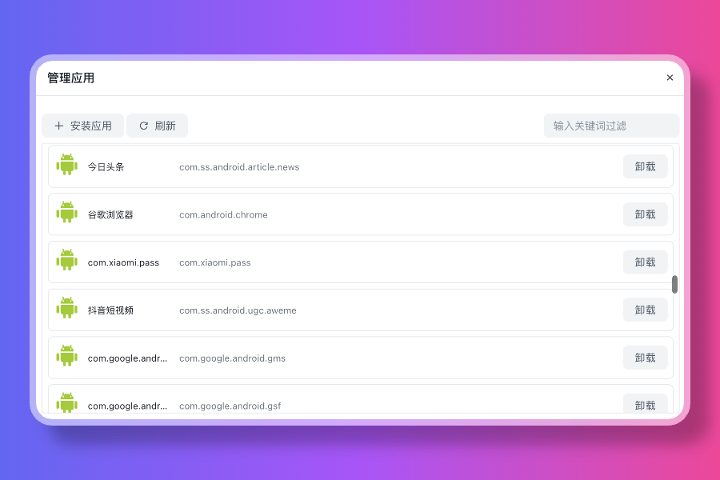

# LinkAndroid


## Guide

【[中文文档](./README-CN.md)】 【[English](./README.md)】

`LinkAndroid` is an all-in-one mobile phone connection assistant that can easily connect `Android` and computers. After connecting the phone, you can screen mirroring, GIF/MP4 screen recording, screenshots, file management, and phone operation.

## Features

- multiple phone connect supported
- screen mirroring, based on scrcpy, support phone operation
- screenshot, image beautifier will be opened automatically after screenshot
- GIF/MP4 screen recording
- application management
- file management, support upload/download/delete
- shell command, support adb, screen command and phone shell command
- 1i8n support, English/Simplified Chinese supported 

## Previews

### Screen mirroring


### Screen recording



### Screenshot



### Command line


### App management



## Get the app

### Windows

- download Windows installer from [https://linkandroid.com](https://linkandroid.com)

### MacOS

- download MacOS installer from [https://linkandroid.com](https://linkandroid.com)
- install `scrcpy` manually, refer to [scrcpy tutorial](https://github.com/Genymobile/scrcpy)
    - [https://github.com/Genymobile/scrcpy/blob/master/doc/macos.md](https://github.com/Genymobile/scrcpy/blob/master/doc/macos.md)

### Linux

- download Linux installer from [https://linkandroid.com](https://linkandroid.com)
- install `scrcpy` manually, refer to [scrcpy tutorial](https://github.com/Genymobile/scrcpy)
    - [https://github.com/Genymobile/scrcpy/blob/master/doc/linux.md](https://github.com/Genymobile/scrcpy/blob/master/doc/linux.md)

## We uses

- `electron`
- `vue3`
- `typescript`

## Development

> only node 20 tested

```shell
# install dependencies
npm install
# run in dev mode
npm run dev
# build
npm run build
```

## Thanks

- [image-beautifier](https://github.com/CH563/image-beautifier)
- [scrcpy](https://github.com/Genymobile/scrcpy)
- [adb](https://developer.android.com/studio/command-line/adb)
- [ffmpeg](https://ffmpeg.org/)

## License

GPL-3.0
