<div align="center">
  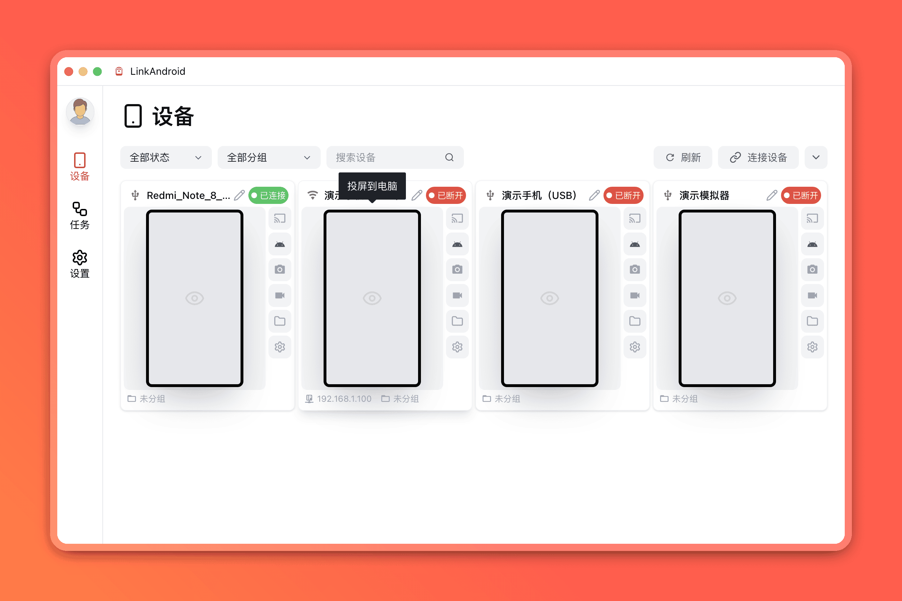
</div>

<h1 align="center">LinkAndroid — 全能 Android 手机连接助手</h1>

<div align="center">
  <a href="https://linkandroid.com" target="_blank">
    
  </a>
  
  <a href="https://github.com/modstart-lib/linkandroid" target="_blank">
    
  </a>
  <a href="https://gitee.com/modstart-lib/linkandroid" target="_blank">
    
  </a>
  <a href="https://gitcode.com/modstart-lib/linkandroid" target="_blank">
    
  </a>
  <br/>
  <a href="./README.en-US.md">English</a> · <strong>简体中文</strong>
</div>

<p align="center">
  <strong>LinkAndroid</strong> 是一款基于 Electron 的全能 Android 手机连接桌面工具。通过 USB 或无线网络连接手机后，您可以在电脑上完成<strong>投屏操控、截屏美化、GIF/MP4 录屏、文件管理、应用管理、ADB Shell、脚本自动化、AI 模型集成</strong>等操作，一站式提升 Android 设备的使用效率。
</p>

<p align="center">
  <b>🚀 开源 · 跨平台 · 强大 · 易用</b>
</p>

---

## 📦 安装

| 平台 | 安装说明 |
|------|---------|
| **Windows** | 访问 [linkandroid.com](https://linkandroid.com) 下载安装包，一键安装即可 |
| **macOS** | 访问 [linkandroid.com](https://linkandroid.com) 下载安装包，一键安装即可 |
| **Linux** | 访问 [linkandroid.com](https://linkandroid.com) 下载安装包，一键安装即可 |

---

## ✨ 功能特性

### 🔗 多设备连接与管理

支持同时连接多台 Android 设备，可通过 USB 或无线方式快速配对。

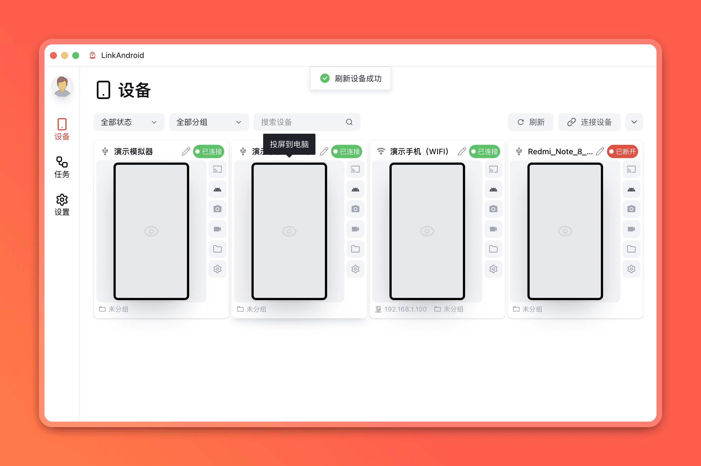

- **USB 即插即连** — 插入 USB 自动识别连接
- **无线扫码配对** — 扫描二维码即可完成无线连接
- **配对码连接** — 输入 6 位配对码快速配对
- **Wi-Fi 直连** — 通过 IP:端口手动连接网络设备
- **mDNS 自动发现** — 自动扫描局域网内的 Android 设备
- **设备分组管理** — 对设备进行分组，快速筛选过滤

| 扫码配对 | 配对码连接 | 分组管理 |
|:--------:|:----------:|:--------:|
| 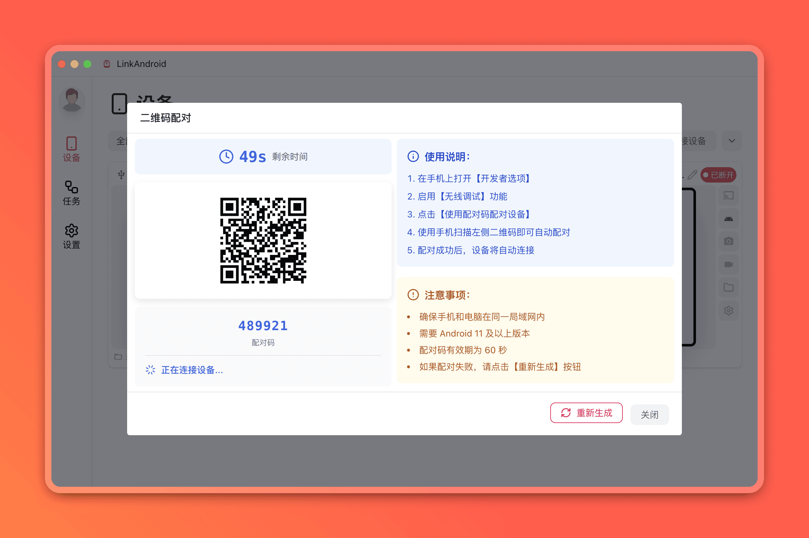 | 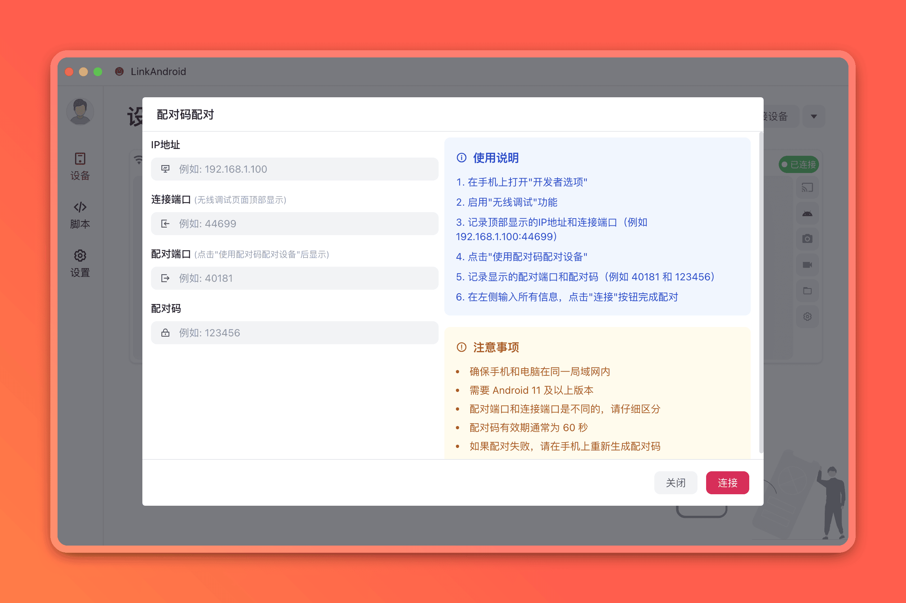 | 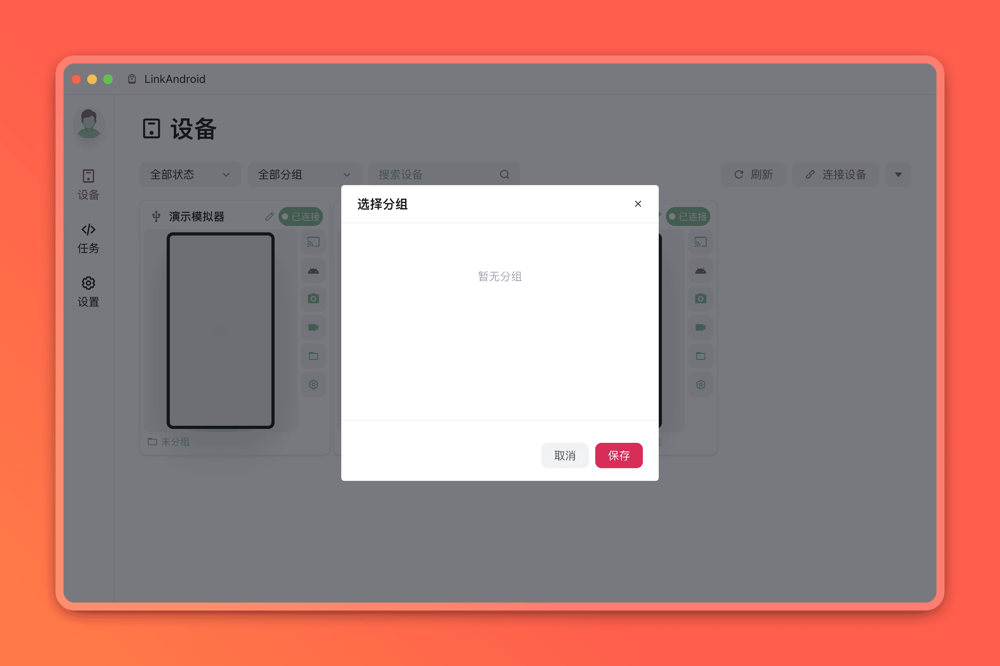 |

### 🖥️ 投屏操控（Scrcpy）

基于 [scrcpy](https://github.com/Genymobile/scrcpy) 实现低延迟投屏，支持鼠标和键盘反向操作手机。

- **一键镜像** — 低延迟、高画质屏幕镜像
- **反向控制** — 使用电脑键盘鼠标操控手机
- **OTG 模式** — 将电脑作为键盘鼠标模拟器
- **摄像头投屏** — 调用手机摄像头实时画面，可选分辨率和帧率
- **跟随模式** — 多设备操作同步
- **可调参数** — 码率、帧率、窗口置顶、边框显示等

| 摄像头投屏 | 设备镜像设置 |
|:----------:|:-----------:|
| 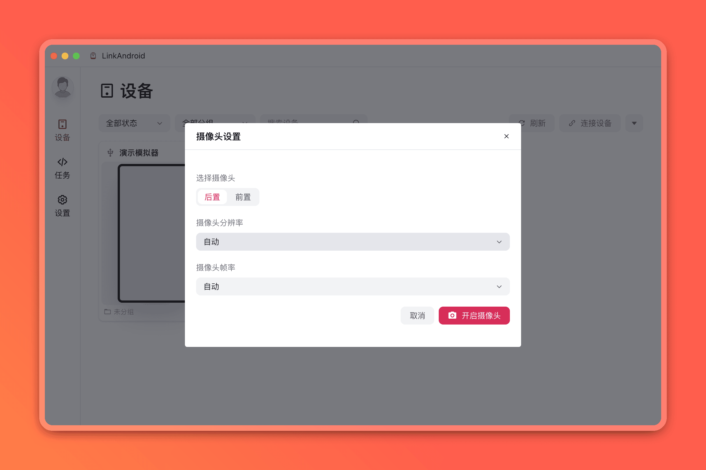 | 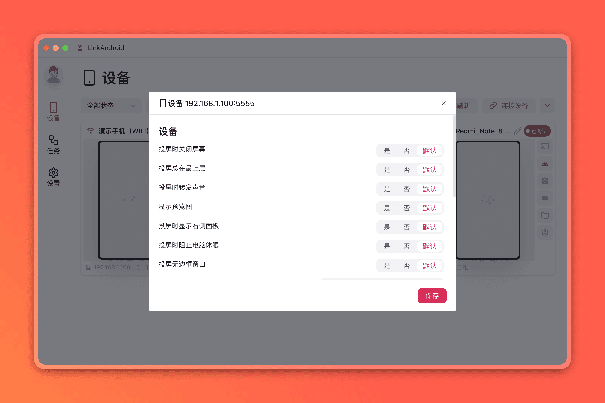 |

### 📸 截屏 & 美化

一键截屏并自动打开内置的截屏美化工具，快速为截图添加设备边框、渐变背景等效果，生成适合社交媒体分享的精美图片。

### 🎥 GIF/MP4 录屏

支持将手机屏幕录制为 **MP4** 或 **GIF** 格式，可自定义录制时长和画质，方便制作产品演示、教程或 Bug 复现素材。

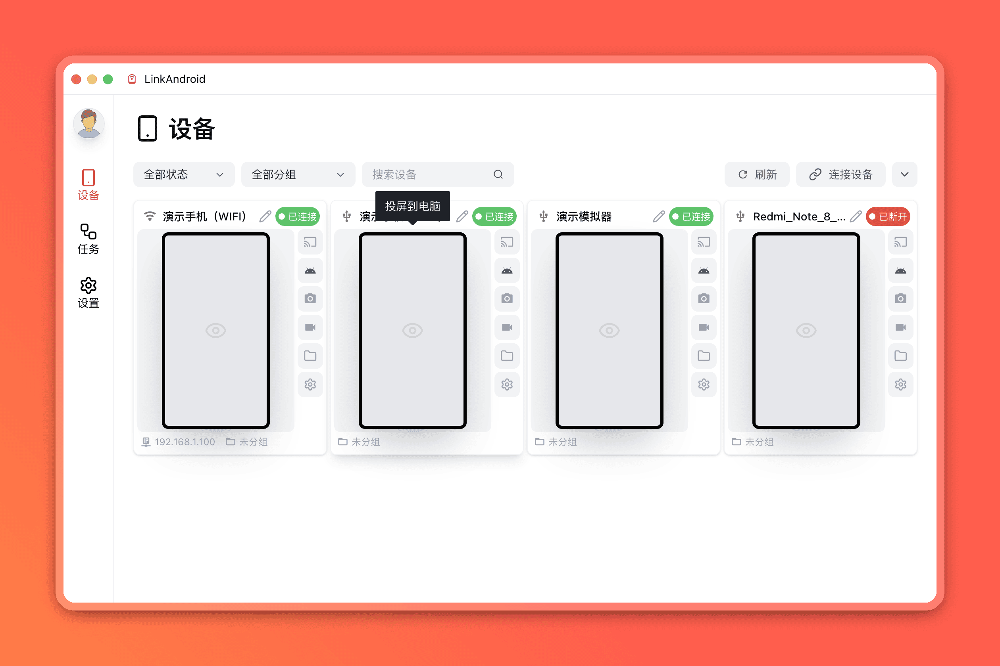

### 📁 文件管理

内置文件管理器，支持在电脑上浏览、上传、下载、删除、重命名手机文件。支持列表/网格两种视图，可按名称、时间、大小排序。

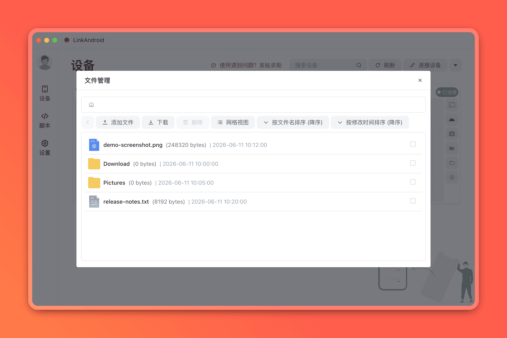

### 📱 应用管理

支持查看已安装应用列表、批量卸载应用、通过文件选择器安装 APK，轻松管理手机上的所有应用。

### 💻 命令行工具

内置 **ADB Shell** 终端和命令快捷面板，可执行 adb 命令和 Android Shell 命令，提供常用命令一键插入。

| ADB Shell | 命令快捷面板 |
|:---------:|:-----------:|
| 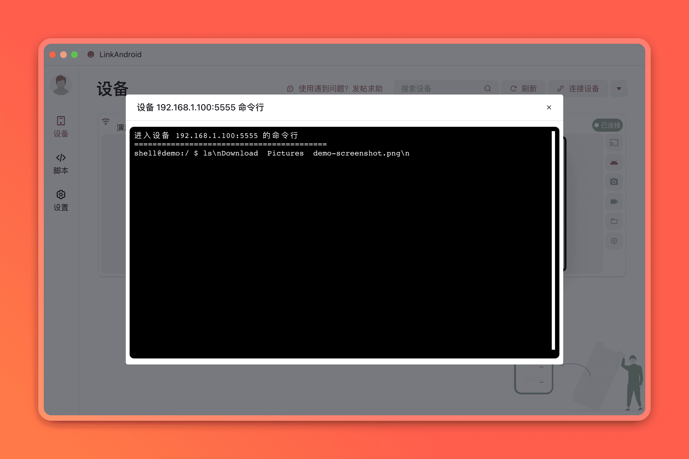 | 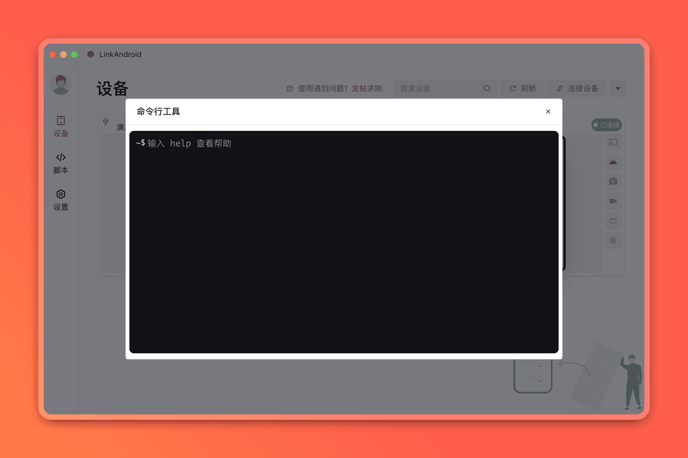 |

### 🤖 脚本自动化

支持编写和运行 Python 自动化脚本，实现批量操作和工作流自动化。

- **可视化编辑器** — 内置代码编辑器，支持语法高亮
- **Cron 定时调度** — 按 Cron 表达式定时执行任务
- **多设备执行** — 选择在多台设备上运行同一任务
- **运行日志** — 查看任务执行历史和详细日志
- **HTTP API** — 通过 REST API 远程触发任务（端口 53030）

| 任务列表 | 任务编辑器 |
|:--------:|:----------:|
| 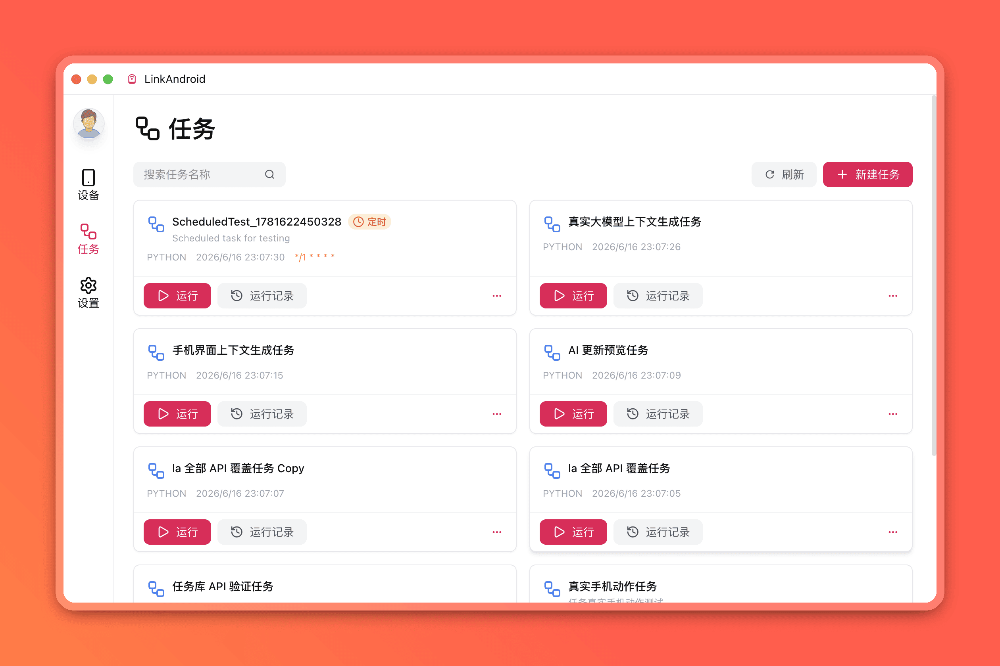 | 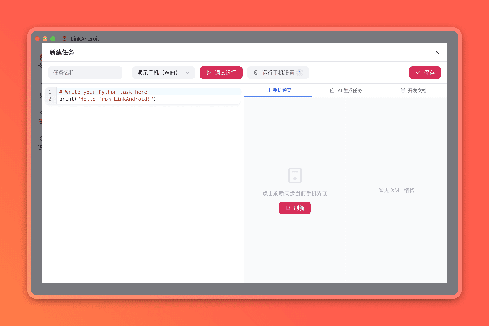 |

### 🌐 CLI 远程控制与 HTTP API

内置 HTTP 服务器，提供 RESTful API 进行远程控制：

| 接口 | 说明 |
|------|------|
| `POST /api/devices` | 获取设备列表 |
| `POST /api/task/list` | 列出所有任务 |
| `POST /api/task/get` | 按 ID 查询任务 |
| `POST /api/task/run` | 远程触发任务运行 |
| `POST /api/task/history` | 查看任务执行历史 |

支持 Bearer Token 认证，可集成到 CI/CD 或自动化流水线中。

### 🧠 AI 模型集成

内置 **47+ AI 模型提供商**的支持，包括 OpenAI、DeepSeek、智谱、千问、通义千问、Ollama（本地）、Anthropic Claude、Google Gemini 等。

- **模型管理** — 集中管理各厂商 API Key 和模型配置
- **AI 辅助编程** — 在任务编辑器中通过 AI 辅助生成脚本代码
- **Prompt 配置** — 灵活配置提示词参数

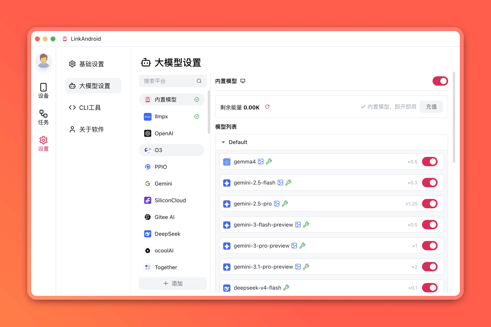

### 🌍 国际化

支持 **简体中文** 和 **English** 两种语言，可根据系统语言自动切换，无需手动配置。

### 🌗 深色模式

支持浅色/深色/跟随系统三种主题模式，保护视力，体验一致。

---

## 🖼️ 更多截图

| 默认设备设置 | 设备设置 | 设置页面 | 关于页面 |
|:-----------:|:--------:|:--------:|:--------:|
| 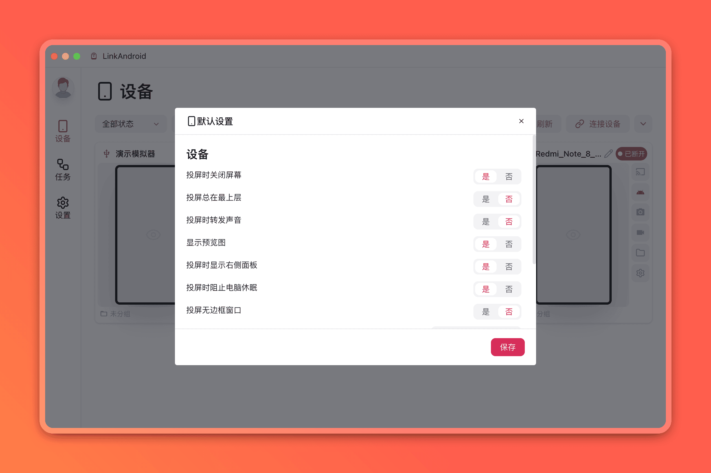 | 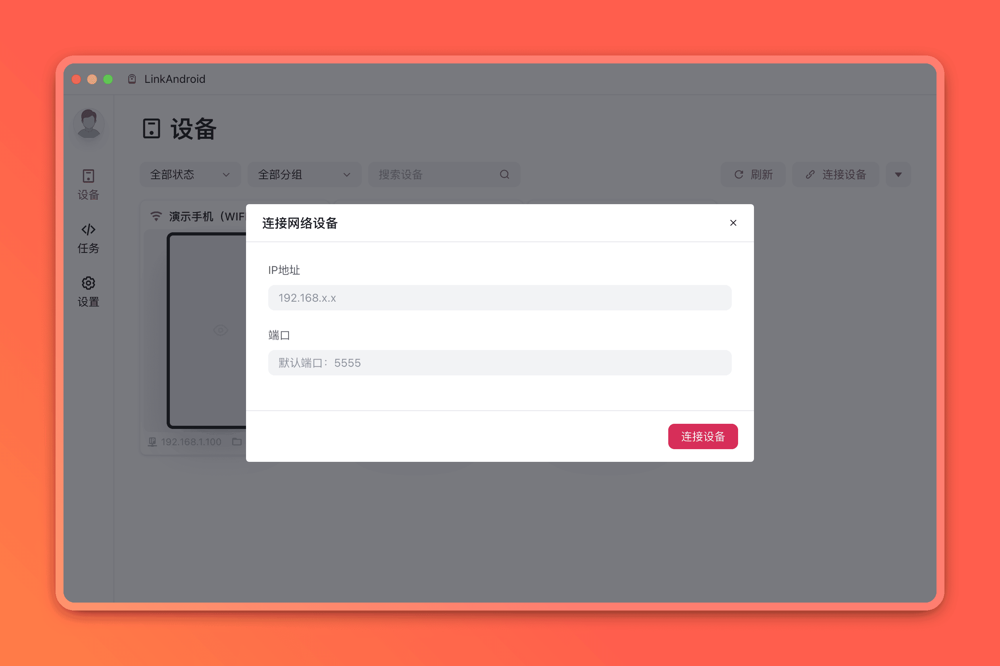 | 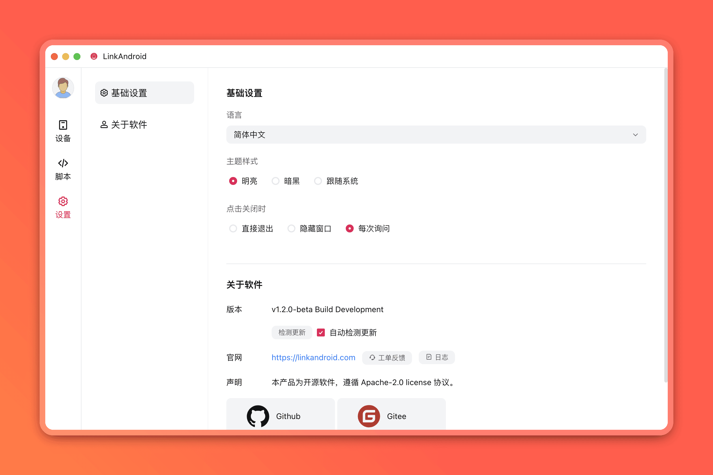 |  |

---

## 🚀 本地开发

> 仅在 **Node.js 20** 环境下测试过。

```bash
# 克隆仓库
git clone https://github.com/modstart-lib/linkandroid.git
cd linkandroid

# 安装依赖
npm install

# 启动开发模式（自动启动 Electron 窗口）
npm run dev

# 生产构建
npm run build

# 构建预览（仅 Vite 构建，不打包）
npm run build:preview
```

### 开发命令速览

| 命令 | 说明 |
|------|------|
| `npm run dev` | 启动 Vite 开发服务器 + Electron |
| `npm run dev:mac` | macOS 下先杀进程再启动开发模式 |
| `npm run build:preview` | 代码格式检查 + Vite 构建 |
| `npm run build` | 完整构建 + electron-builder 打包 |
| `npm run build:mac` | macOS 平台打包 |
| `npm run build:win` | Windows 平台打包 |
| `npm run build:linux` | Linux 平台打包 |
| `npm run format` | Prettier 代码格式化 |

---

## 🤝 参与贡献

欢迎提交 Issue 和 Pull Request！

1. Fork 本仓库
2. 创建您的特性分支 (`git checkout -b feature/amazing-feature`)
3. 提交您的改动 (`git commit -m 'feat: add amazing feature'`)
4. 推送到分支 (`git push origin feature/amazing-feature`)
5. 打开一个 Pull Request

---

## 💬 加入交流群

> 添加好友请备注 **LinkAndroid**

| 微信交流群 | QQ 交流群 |
|:----------:|:---------:|
|  |  |

---

## 📄 License

This project is licensed under the [Apache-2.0](./LICENSE) License.
